# 1. Project management and documentation

Welcome to an in-depth exploration of project management and documentation using GitLab! This journey unfolds the tools acquired during a recent experience at FabLab, focusing on GitLab's multifaceted aspects. The module not only covers the basics but also delves into advanced functionalities.

## 1. Welcome to GitLab

The initial steps involved creating my GitLab account, a process seamlessly guided by the instructor. Post-account creation, my username was integrated into a shared Excel sheet, and the instructor initiated a basic project for each student. This hands-on introduction laid the groundwork for collaborative work, providing a tangible starting point for our endeavors.


## 2. Configuring GitLab

GitLab can be used for code editing directly on the website or locally on our computer. Understanding the GitLab Web IDE and local coding using tools like Kate significantly enhances our coding efficiency.

### 2.1 GitLab Web IDE

The GitLab Web IDE serves as a powerful platform for code editing, offering a seamless experience directly on the website. Navigating through the Web IDE involves opening the desired file within the project, as illustrated in the sequence of images below:

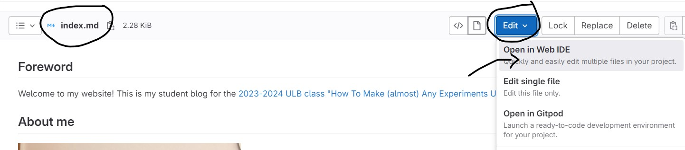


The Web IDE provides an intuitive editing space, making real-time edits straightforward:

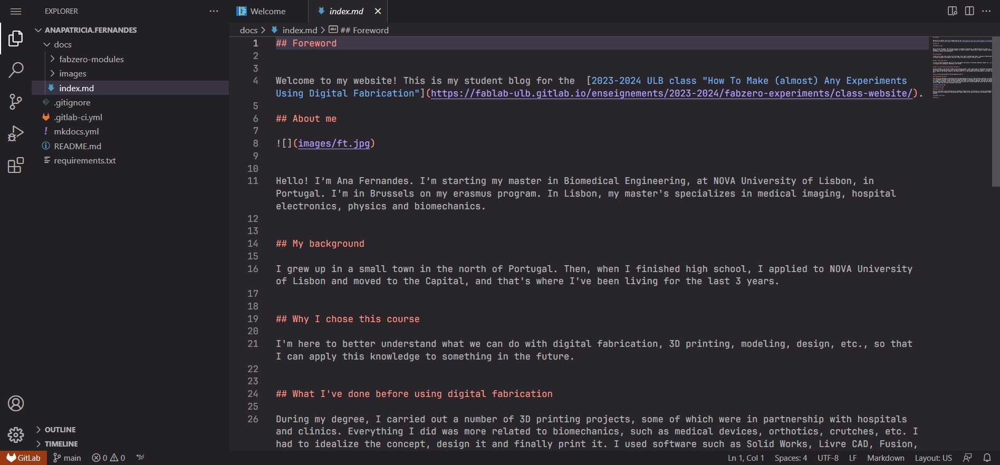

In the GitLab Web IDE I type the word "test". Then I select "Source Control" in the left-hand menu, where the edits made to the document will appear. I click on "commit to main" so that the edits appear on my website.

After making edits, committing changes to the main branch ensures synchronization with the project on the website, as exemplified in the images below:

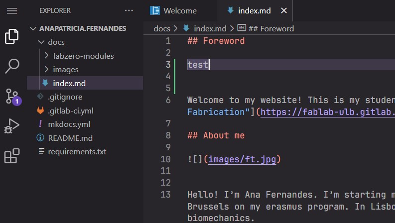
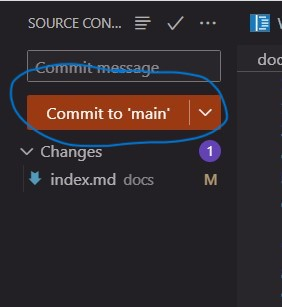

I go back to my project and the word "test" should appear at the top of my page.

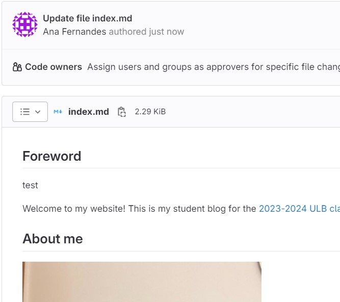

As we can see, it's running correctly.


### 2.2 Local coding

First of all, I installed the [KATE](https://kate-editor.org/pt-pt/) programme from the Microsoft Store.
I chose this programme because it seemed the easiest to use and it's very similar to PhpStorm, which I've used to programme in php and html. So it gets the job done more quickly because I'm more familiar with how to use it.


#### 2.2.1 Configuring Git

Configuring Git on my computer involved following a tutorial that encompassed installing a BASH terminal and verifying Git installation using specific commands.

Git is the programme that bridges the gap between my computer and my project area in GitLab. Through it, we make a clone of our project on our computer and then every time we make code edits on the computer we have to use this program to synchronise those edits with GitLab.

To install GIT on my computer I followed the steps in the following [tutorial](https://docs.gitlab.com/ee/gitlab-basics/start-using-git.html#configure-git).

First I had to install a BASH terminal, and run the following code through it to test if the Git is correctly installed on my computer.

```
Windows PowerShell
Copyright (C) Microsoft Corporation. All rights reserved.

git --version
git config --global user.name "username"
git config --global user.email "example@ulb.be"
git config --global --list
```

#### 2.2.2 Clone a repository

##### 2.2.2.1 Get a SSH Key

To clone the project to my repository, I first had to create an SSH key. This was probably the part I had the most trouble with, as I couldn't identify what my key was.

To better understand how to create an SSH key, I accessed the [tutorial](https://docs.gitlab.com/ee/user/ssh.html) I found in my profile preferences, user settings and SSH keys, as as shown below.

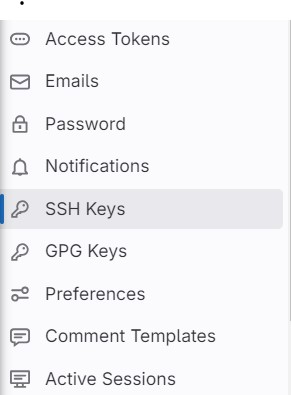

Then I chose to create a new SSH Key and I searched for more information on how to create it via the following [link](https://docs.gitlab.com/ee/user/ssh.html).

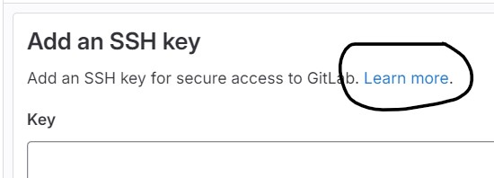

I ran the following code in a terminal by clicking ENTER between each line and accepting the suggestions I was given.


```
Windows PowerShell
Copyright (C) Microsoft Corporation. All rights reserved.

ssh-keygen -t ed25519 -C "<comment>"
Generating public/private ed25519 key pair.
Enter file in which to save the key (/home/user/.ssh/id_ed25519):
Enter passphrase (empty for no passphrase):`
Enter same passphrase again:
```


Then the following document ```id_ed25519``` was created in the ```.ssh``` folder of my directory in Publisher format. To access the contents of this document, I had to use a [website](https://online2pdf.com/convert-publisher-to-txt) that transformed this format into .txt. Once transformed, I opened the .txt file containing my ssh key. I copied it and added it to my SSH keys in GitLab.

With my SSH key created, I made a clone of my project as follows.

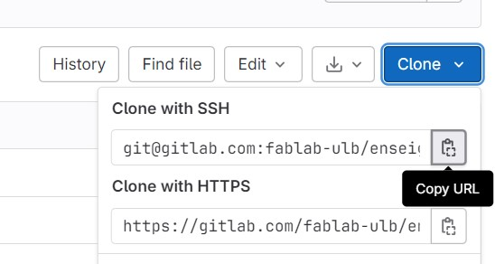

I opened a terminal in my directory and pasted the following code provided in the tutorial I mentioned earlier.


```
Windows PowerShell
Copyright (C) Microsoft Corporation. All rights reserved.

git clone git@gitlab.com:gitlab-tests/sample-project.git
```


And GitLab automatically created a file with my project in my directory.


#### 2.2.3 Getting used with the workflow

This was the most difficult part for me. But after some help from the teacher and watching a few more GitLab tutorials, I finally managed to synchronise the work I was doing directly on my computer with the output on GitLab. Updating the images was undoubtedly the most labour-intensive part of the process, with many errors in between.

This is the code I have to enter into my computer terminal to communicate with GitLab

| Git Command              | Meaning                                      |
|--------------------------|----------------------------------------------|
| `git pull`               | Gets the latest version of the work          |
| `git add -A`             | Adds all the changes made                    |
| `git commit -m "update"` | Commits the changes with a message "update"  |
| `git status`             | Shows the changes that have been made
| `git push`               | Sends the changes made to the server         |


## 3. Start writing on my website

Starting to write on your website involves utilizing Markdown, a lightweight markup language that allows you to format text easily. Markdown is widely used for creating content on platforms like GitLab due to its simplicity and compatibility with HTML.

### 3.1 Text

Markdown Basics:


| Git Command              | Meaning                                      |
|--------------------------|----------------------------------------------|
| `# Header 1`             | # Header                                     |
| `## Header 2`            | ## Header 2                                  |
| `### Header 3        `   | ### Header 3                                 |
| `**bold**`               | **bold**                                     |
| `*italic*`               | *italic*                                     |
| `- Item 1`               | - Item 1                                     |
| `- Item 2`               | - Item 2                                     |
| `1. Subitem 2.1`         | 1. Subitem 2.1                               |
| `*Item`                  | *Item

For a comprehensive Markdown cheat sheet, you can refer to the [Markdown Guide](https://www.markdownguide.org/cheat-sheet/). This resource provides quick reference for all Markdown syntax, ensuring you can structure your content effectively.


### 3.2 Images

Adding images to your website involves a straightforward Markdown syntax:

```

```
Here, replace "Alt text" with a descriptive alternative text for accessibility, and adjust the path and image name accordingly. Keep in mind that Markdown supports various image formats, including jpg and png.
I've only used jpg images because I think it's easier to manage.

Image Editing with GIMP:
To adjust the size of images, you can use tools like [GIMP](https://www.gimp.org/downloads/). Here's a simplified guide:

1. Open an image in GIMP.
2. Navigate to "Image" > "Scale Image."
3. Adjust the desired sizes.
4. Export the edited image in jpg format.


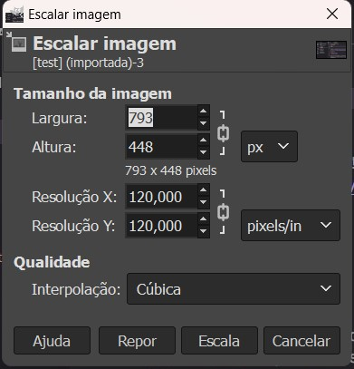


### 3.3 Links

Adding links in Markdown involves the following syntax:

```
[Link text](URL)
```
Replace "Link Text" with the anchor text and "URL" with the actual link.

### 3.4 Code Blocks

To include code blocks, use triple backticks:

``` code ```

This helps maintain code formatting within your content.

Example:

To learn more about Markdown, visit the [Markdown Guide](https://www.markdownguide.org/cheat-sheet/).

Here's an example of a code block:

\```
print("Hello, World!")
\```

### 3.5 3D Modulation

In the second and third modules, a 3D modulation was inserted. To create the presentation template I followed the tutorial that my colleague [Lukas](https://lukas-schieble-fablab-ulb-enseignements-2023-202-7d8ba2172c0a0f.gitlab.io/) posted in his [documentation](https://lukas-schieble-fablab-ulb-enseignements-2023-202-7d8ba2172c0a0f.gitlab.io/fabzero-modules/module01/#sketchfab).

## 4. Installing mkdocs

First of all we have to install [Python](https://www.python.org/downloads/). Choose all the parameters.
With the Python installed, open a terminal in the folder containing all your project files and paste the following code:

```
Windows PowerShell
Copyright (C) Microsoft Corporation. All rights reserved.

pip install mkdocs
```

Then ````cd```` followed by the adress for your path, mine was ```cd C:\Users\aprfe\anapatricia.fernandes```.
After that paste ```mkdocs serve``` and the mkdocs will build your website. And then a link will appear, like this [http://127.0.0.1:8000/enseignements/2022-2023/fabzero-experiments/template/]( http://127.0.0.1:8000/enseignements/2022-2023/fabzero-experiments/template/). If I copy and paste it into a new internet tab, it will redirect me to my website.

This is just an example of how the link appears in the terminal, it won't direct you anywhere because this link only works on my computer as long as I have the terminal open running the code that comes in response to mkdocs serve.

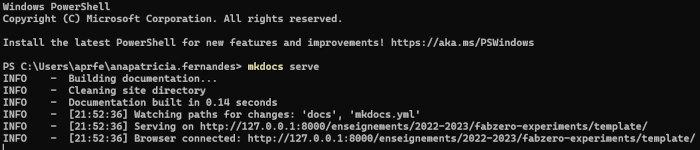

Until then, in order to quickly see how my documentation would appear on the course website, I would force the pipelines that were scheduled. Now it's much easier and more accurate.


## 5. Issues

The issues tool was implemented by uploading a `.csv` file that already contained the procedures the students had to follow to complete their work. Once applied to our GitLab environment, it was quite intuitive to mark the tasks completed and understand what steps to take next.

As we complete the tasks in each module, we will update their development until they are all finished.

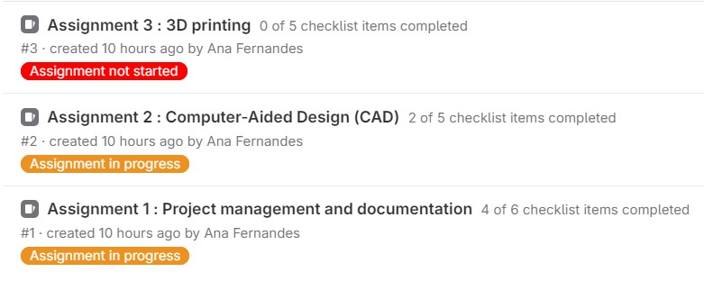


## 6. Use project management principles

Implementing project management principles through GitLab proves instrumental in collaborative coursework. It facilitates progress sharing, aids issue resolution, and promotes efficient group work. This approach promises to be beneficial for future collaborative endeavors.

The integration of GitLab's tools into the project management and documentation process significantly enhances efficiency, providing a robust framework for both individual and collaborative work in practical courses.


