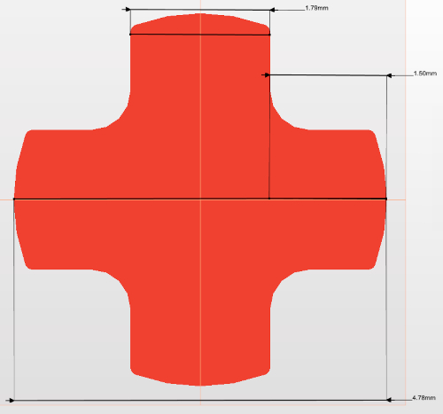
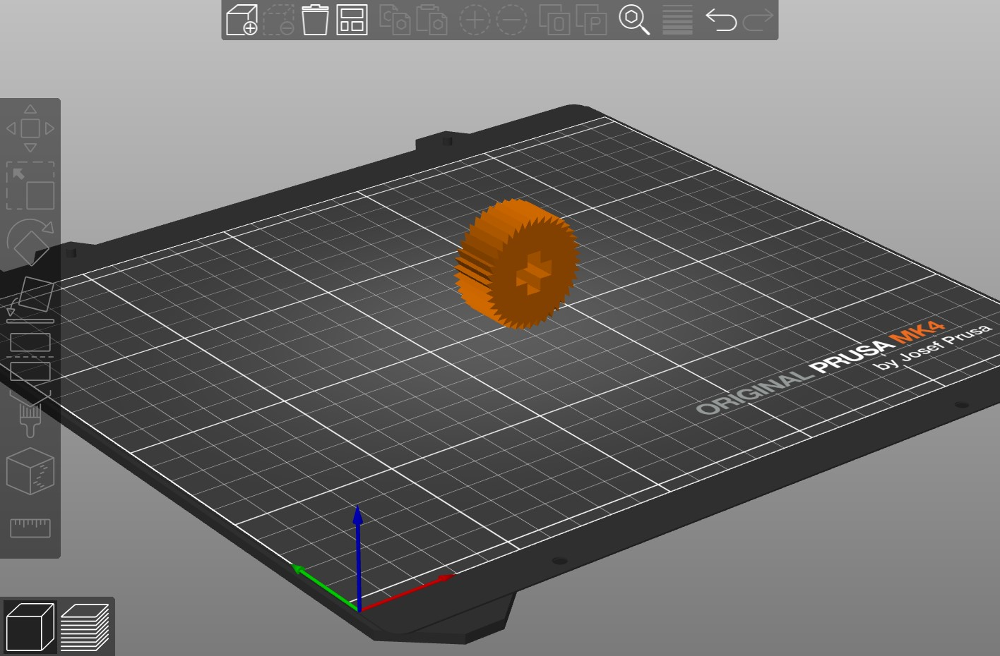
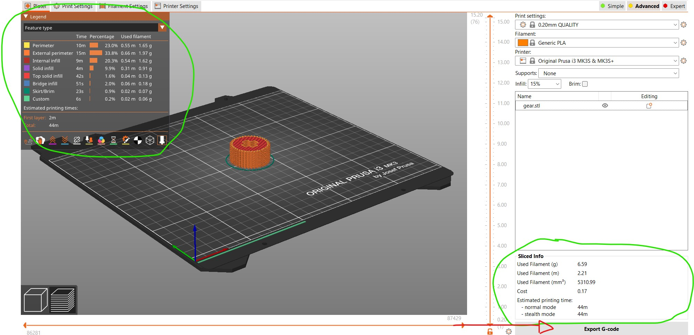
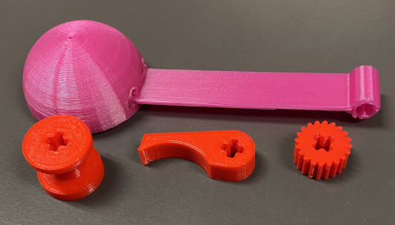

# 3. 3D printing

During this module we had the opportunity to print our pieces made in the previous module

## 3.1 Piece Test

Before printing the parts for our catapult, we first had to print a test piece to find out the exact measurements that the holes in our parts had to have in order to be implemented in the Lego piece we used to make the mechanism work.

### 3.1.1 OpenSCAD draw

For this test, my group mate, [Lukas](https://lukas-schieble-fablab-ulb-enseignements-2023-202-7d8ba2172c0a0f.gitlab.io/), made a piece with several cross holes, each with a different size. The aim is to realise which one the lego piece we're going to use fits into best.



### 3.1.2 Printing

To print the part:

* Convert the file to STL format and import it into the [Prusa Slicer] program (https://help.prusa3d.com/article/install-prusaslicer_1903).

* It is very important to choose the correct side of the part that will be in contact with the machine. For example, if I wanted to print my part like this:



The piece would probably fall off and ruin the printing process.

So I chose to turn the part over, flat side down, by doing the following procedure.

1. Select the part
2. Click on the 4th tool in the left-hand menu, "Place on face", or press [F].
3. Click on the side of the part you want to choose to be in contact with the support.


* Select the material you want to use to print the part, in my case it was generic PLA, and also select the printer configuration that best suits your project.

* Insert an SD card which you will use to transfer your file to the 3D printer

* Click on Slide Now and you'll see some information about the printing process, the time, a description of the procedure, etc. Then click on Export G-code.



* Save your file on the SD card and insert it into the 3D printer to start printing.

Note: Some parts may need additional support due to their geometry, in my case it wasn't necessary. This is most often the case with parts that have 2 planes and there is nothing between them, so the 3D printer adds some filler that needs to be removed (broken) after the printing process. In addition, you must first clean the support so that any impurities in it don't interfere with your work.


### 3.1.3 Final Test

Once printed, we tried out which one the lego piece we're going to use would fit into best.

Then we realised that the hole in the cross would have to have the following dimensions:

```
h = [5, 1.87, 10];
v = [1.87, 5, 10];
```

## 3.2 Print all parts

Once we had established the right measurements for the parts of our catapult, it was finally time to print them.

We did the same process of passing the file in STL format to Pausa Slicer, adjusting the desired parameters.

<div class="sketchfab-embed-wrapper"> <iframe title="Gear" frameborder="0" allowfullscreen mozallowfullscreen="true" webkitallowfullscreen="true" allow="autoplay; fullscreen; xr-spatial-tracking" xr-spatial-tracking execution-while-out-of-viewport execution-while-not-rendered web-share src="https://sketchfab.com/models/845bca910bba4ee4af0392401a85c5d1/embed"> </iframe> <p style="font-size: 13px; font-weight: normal; margin: 5px; color: #4A4A4A;"> <a href="https://sketchfab.com/3d-models/gear-845bca910bba4ee4af0392401a85c5d1?utm_medium=embed&utm_campaign=share-popup&utm_content=845bca910bba4ee4af0392401a85c5d1" target="_blank" rel="nofollow" style="font-weight: bold; color: #1CAAD9;"> Gear </a> by <a href="https://sketchfab.com/apr.fernandes?utm_medium=embed&utm_campaign=share-popup&utm_content=845bca910bba4ee4af0392401a85c5d1" target="_blank" rel="nofollow" style="font-weight: bold; color: #1CAAD9;"> apr.fernandes </a> on <a href="https://sketchfab.com?utm_medium=embed&utm_campaign=share-popup&utm_content=845bca910bba4ee4af0392401a85c5d1" target="_blank" rel="nofollow" style="font-weight: bold; color: #1CAAD9;">Sketchfab</a></p></div>


Here we have all the pieces of our mini project printed out and ready to assemble.



We then assembled our mechanism and tested it.


<video width="640" height="360" controls>
  <source src="../images/catapult_test_2.mp4" type="video/mp4">
  Your browser does not support the video tag.
</video>


