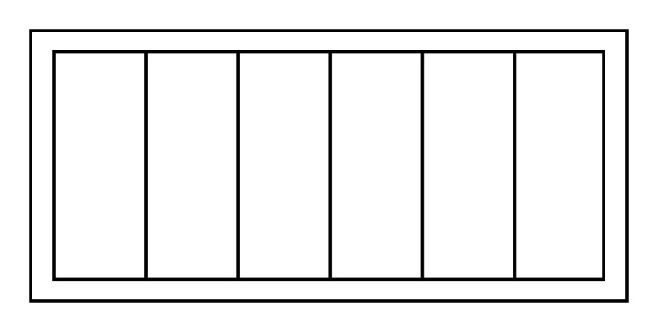
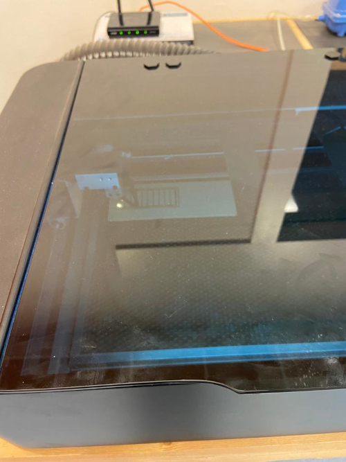
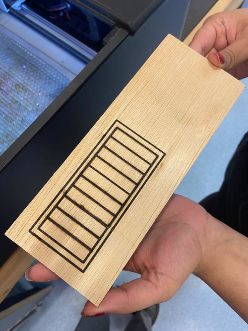
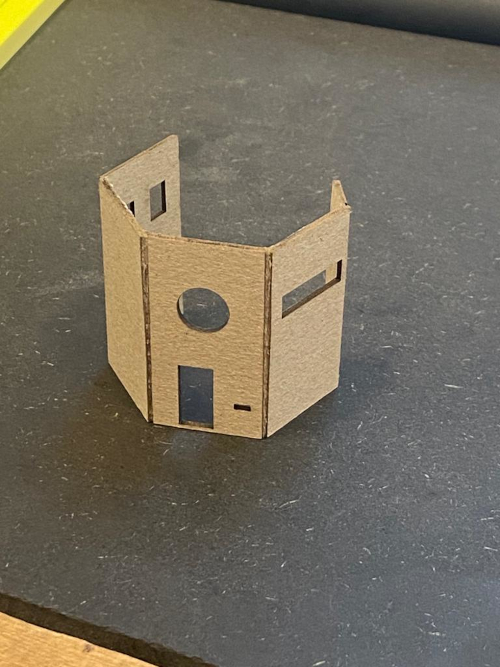
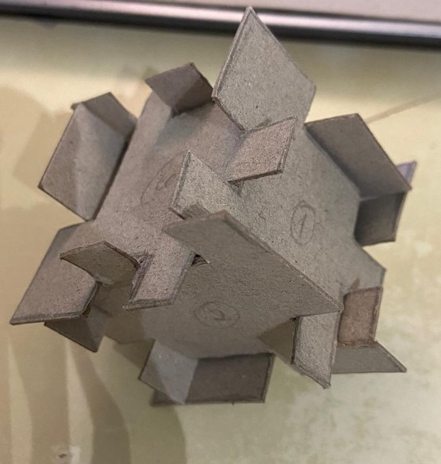
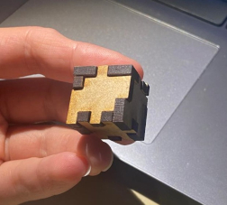
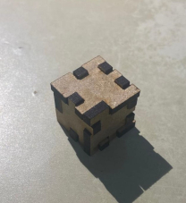
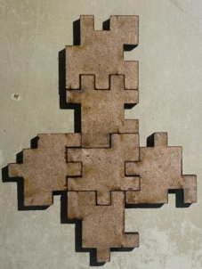

# 4. Laser Cutting

For this working week I chose the Laser Cut training workshop, because it was something I'd never done before, so it was the assignment that aroused my interest the most.

## 4.1 Before using the machines

Before coming into contact with the machines, we were given a short quiz on their safety measures.
Note: If you don't understand French perfectly, please translate the questions correctly and don't be like me, who thought I could answer the quiz easily.

The information we needed to know to answer the quiz can be found in the following [Turotial](https://gitlab.com/fablab-ulb/enseignements/fabzero/laser-cut).

## 4.2 2D Draw

Firstly, I drew the following picture in Inkscape.

## 4.3 Laser Cut

### 4.3.1  Using MUSE Laser Cut machine

We started by using the MUSE laser cutter, with the following specifications:

Cutting surface: 50 x 30 cm
Maximum height: 6 cm
LASER power: 40 W
Type of LASER: CO2 (infrared) + red pointer
Software: Retina Engrave

[Tutorial](https://www.youtube.com/playlist?list=PL_1I1UNQ4oGa0w55C772Y1mC6F4f3ZcG6)

To use this machine I had to connect to a Wi-Fi network generated by the machine itself.

This machine didn't have enough power to cut the material we chose, so it just made the following markings.

### 4.3.2 Using Epilog Fusion Pro 32

To test another type of cutter, we decided to use the Epilog cutter, with the following specifications:

Cutting surface: 81 x 50 cm
Maximum height: 31 cm
LASER power: 60 W
Type of LASER: CO2 (infrared)
Software: Epilog Dashboard

[Manual](https://gitlab.com/fablab-ulb/enseignements/fabzero/laser-cut/-/blob/main/Epilog.md)

To test this machine we chose the design of the house that was already in gitlab.
To use this machine, I had to transfer the file containing the drawing I wanted to cut to the computer associated with the machine, using a USB drive.

In this laser cutter we can choose different colours that correspond to different laser powers and speeds. For example, in this case we used red and black. Black with high power and low speed to allow us to cut the material well, and red with low power and high speed to only make a superficial cut so that the piece bends in that area.

The end result of this application was the following object.

## 4.4 My own project

At the end of the lesson we were proposed by the teacher to make a set of pieces that would fit together without using anything more than the power of the pieces themselves to fit together, so I made the following puzzle model that I designed using the knowledge I had acquired in [Module 2](https://anapatricia-fernandes-fablab-ulb-enseignements-2-d18a5513a59a59.gitlab.io/fabzero-modules/module02/#13-my-project).

This isn't my final work, it was just a small model to see if the geometry I'd drawn would allow all the pieces to fit together. I needed to do this test before cutting the wood (ideally) that I'm going to use.

To cut the final piece, I chose this type of wood that was available at FABLAB. At first, I had some difficulty figuring out what power and speed would be needed to cut this material, so I asked a FabLab member of staff for help and together with him I carried out a series of tests to find out which frequency and power were suitable for cutting my piece.

Then, using 10% speed and 95% power, I managed to cut out the puzzle pieces.

The end result wasn't as good as I'd hoped, but the final piece holds together without using glue or anything else with the same effect, so I think the goal was achieved. Considering that my piece was quite small, the machine's cut ended up affecting the fit of my piece. To get round any imperfections, I tried to make my piece in inkscape with exactly 3mm in each part, so that they fit perfectly.

