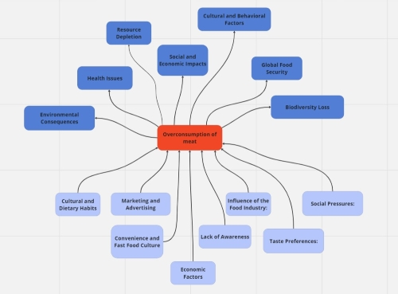
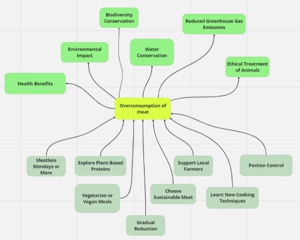

# 5 Group dynamics and final project

For this module, we started by creating the group with which we will carry out the project.

## 5.1 Project Analysis and Design

To start our creative thinking process, we began by watching the following [video](https://www.youtube.com/watch?app=desktop&v=9KIlK61RInY) on problem and solution trees as a guide.

For this module we first had to draw up our own problem and solution tree. For me, a very important issue, which has been a problem we've been dealing with for many years and which is having more and more consequences, is the overconsumption of meat.

So here are my problem and solution trees for this issue.

 

## 5.2 Group formation and brainstorming on social issues

### Social issues

We brought many issues to the table(the floor in this case), some of them related to environmental pollution, plastic waste, empty and useless buildings in Brussels, water and soil contamination, health problems, etc.

### My experience

At the time I used the expression "out of the box" to describe the sensation I felt with this group dynamic, because it was the first time I had created a group based on our interests and points of view. So far, in all the projects I've done during my degree, I've formed a group with friends or people I know better. But I think this option is much better in many ways, because we are working together on something that is in everyone's interest, and only then will we find a problem and a solution to it. For me, they're total strangers, so it'll be interesting to discuss various subjects with them, because we don't share any past experience or any kind of relationship, so there are no barriers and I'm expecting something different and stimulating.

### The object

For this dynamic, we had to bring an object to class that, for us, represented a problem, which could be related to society, the environment, infrastructure, etc.

I brought an empty box of pencil leads, because for me it represents a useless object, if I want to use my pencil again I have to buy another box. I should be able to use this same box to buy more graphite leads, to be able to reuse it, but I can't. It's just a waste of plastic. That's why I brought this object representing an environmental problem.

My colleagues also brought some objects, and the ones that most caught my eye were: a coin (because money is a very good thing, of course, but it's the cause of many problems in the world), an architecture book (representing the infrastructure problems in Brussels) and a spanner.
So, as the owners of these objects, we formed a group of four.

## 5.3 Group dynamics

During this module we were introduced to the dynamics of group work, which we should apply during our final project.
As a group we implemented some of the tools we were taught. In particular, whenever we have a meeting, we start by saying how we felt at the time and what were the highlights of our week. With this little exercise we've been able to get to know our group mates better and even find activities and hobbies that we identify with.
Another important tool we've been using since the day the group was formed is to divide up tasks. Assign the task of : *Animateur*, *gestion du temps*,
*secrétaire* and *ambiance* to each member of the group. Lukas is the host, the person who guides and co-ordinates the meeting, I'm the time manager and Diane is the secretary and Jean controls the meeting environment, its job is to make sure that everyone is excited and enthusiastic about working.
Last but not least, an essential rule for our group to function properly is to divide tasks between all the members and assign specific goals to each task. With this method, it's easier to ensure that all the steps needed to move forward are being done correctly and on time.

