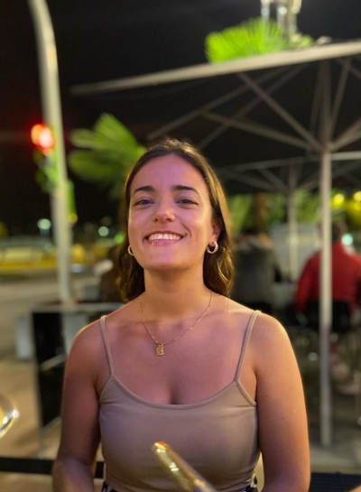
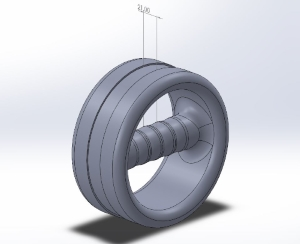
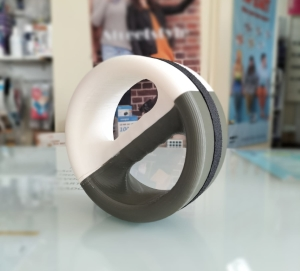
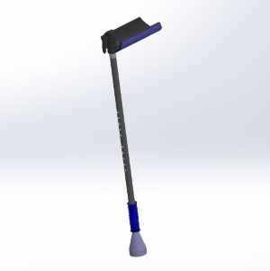

## Ana´s FabLab page

This is my student blog for the  [2023-2024 ULB class "How To Make (almost) Any Experiments Using Digital Fabrication"](https://fablab-ulb.gitlab.io/enseignements/2023-2024/fabzero-experiments/class-website/).

## Welcome

## Who am I?

Hello! I’m Ana Fernandes. I’m starting my master in Biomedical Engineering, at NOVA University of Lisbon, in Portugal. I'm in Brussels on my Erasmus program.

I grew up in a small town in the north of Portugal. Then, when I finished high school I moved to the Capital, and that's where I've been living for the past 3 years.

One of my favourite things to do is to travel and discover new places. A while ago I started making postcard collections of the different cities I visit, so my goal after my Erasmus semester is to have so many postcards that they cover the whole wall of my room. Along with the pleasure of travelling comes the pleasure of trying different beers from different countries and adding to my list of beer reviews.

Perhaps more than travelling, one of my favourite things to do is listen to music. I listen to music in any situation, I can even say that a 10-minute metro journey is a nightmare if I don't have my headphones with me. My favourite band is Red Hot Chili Peppers, and my whole musical taste is based on rock, indie-rock and some blues. And my favourite individual artist, totally outside the musical style I mentioned earlier, is [Slow J](https://open.spotify.com/intl-pt/artist/7crp1tZcefnjT5RuL6WZQ0?si=O-jvPLK_QU2IrJ2lmpS4TA), an incredible Portuguese artist. I totally recommend. *P.S.: not sponsored (unfortunately).*

And of course, if I do these things that I like to do the most with my friends, they become even better.

## Why this course?

I'm here to better understand what we can do with digital fabrication, 3D printing, modeling, design, etc., so that I can apply this knowledge to something in the future.
During my degree, I carried out a number of 3D printing projects, some of which were in partnership with hospitals and clinics. Everything I did was more related to biomechanics.

### Projects

Here you can see some projects that I made during my degree.

#### Pronosupination device

This device was developed in partnership with the physiotherapy service at Lisbon University Hospital. Its function is to strengthen the muscles that provide the pronation movement in patients who have lost their muscular dexterity as a result of accidents, strokes and other problems that affect the neuromotor component. The device was designed in SolidWorks and printed in PLA on a 3D printer. What provides the friction between the device and the surface of use is a rubber that was later attached to the device. 

#### Hydraulic crutch

This is a prototype crutch resulting from an assembly of several parts. Its function is to assist the movement up and down stairs by increasing or decreasing their length, based on the pressure exerted on the hydraulic shock absorber. 

