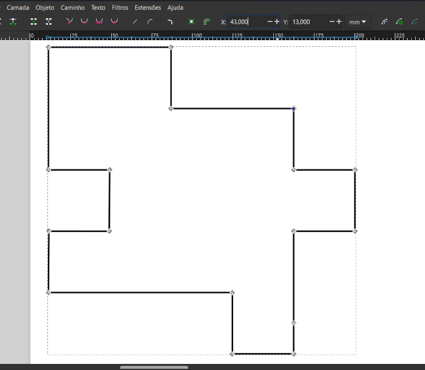
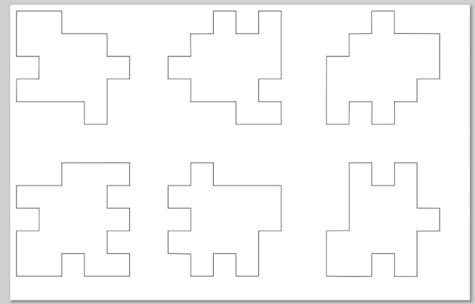
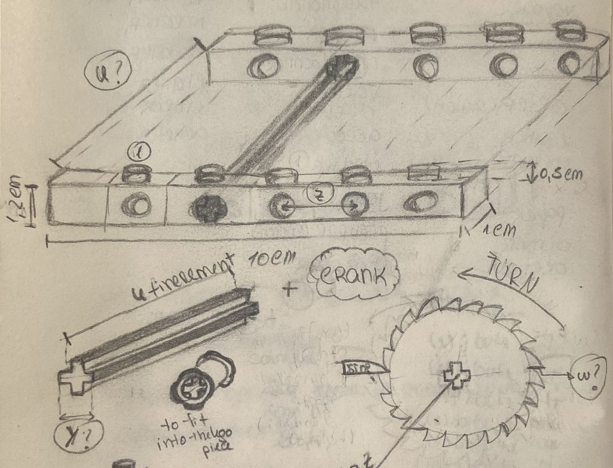
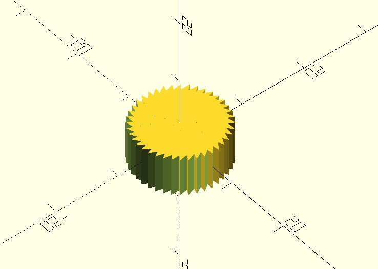
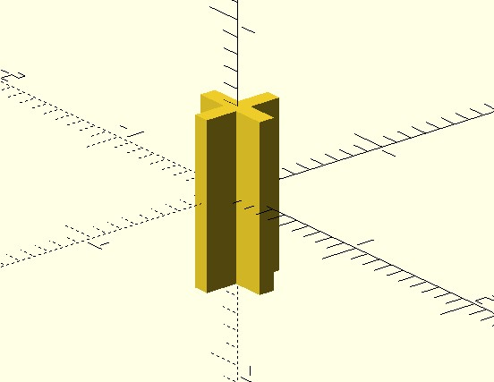
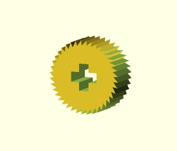

# 2. Computer-aided design (CAD)

Last week, we learnt how to use some computer-aided design software, like Inkscape, OpenSCAD and FreeCAD.

## 1. Inkscape

Inkscape is a powerful, open-source vector graphics editor that provides a user-friendly interface for creating and editing 2D vector graphics. It is widely used for a variety of purposes, including illustration, icon design, logo creation, and more.

### 1.1  Inkscape Features

Inkscape is specifically designed for working with vector graphics, which are images created using mathematical equations rather than pixels. This allows for scalable and high-quality graphics that can be resized without loss of quality.
Primarily uses the Scalable Vector Graphics (SVG) format, an open standard XML-based format for vector graphics. This makes Inkscape interoperable with other vector graphics software and compatible with various web standards.
Users can manipulate paths and shapes by editing individual nodes. This allows for precise control over the shape of objects and the ability to create complex and detailed illustrations.

### 1.2 Inkscape Projects

Inkscape can be used for:

 1. Graphic Design

 2. Icon Design

 3. Logo Design

 Etc.

In summary, Inkscape is a versatile and free vector graphics editor that caters to a wide range of design needs. Whether you're creating illustrations, designing icons, or developing logos, Inkscape provides the tools and features necessary for precise and creative vector graphic editing.

### 1.3 My Project

With the aim of making a piece that, once cut out using the skills learnt in Module 4, would have to be assembled without using glue (or any other material with the same function), I designed the following puzzle.
Assuming that the measurement of each indentation is 1x1 mm, all the other measurements are based on this.




You can see my design file by clicking on the following link.

[Puzzle Idea](https://gitlab.com/fablab-ulb/enseignements/2023-2024/fabzero-experiments/students/anapatricia.fernandes/-/blob/main/docs/fabzero-modules/files/puzzle%20idea.svg?ref_type=heads)


Go on to [Module 4](https://anapatricia-fernandes-fablab-ulb-enseignements-2-d18a5513a59a59.gitlab.io/fabzero-modules/module04/) to find out how to cut these puzzle pieces using FabLab's laser cutting machines.

## 2. OpenSCAD

It's the first time I've modelled pieces using code and programming. Until now I've always been used to drawing "by hand" and shaping it according to what I wanted, which I honestly find easier.
The advantage of this software is that there are lots of libraries and cheats that you can use to get the pieces you want.

### 2.1 3D Project

For this unit, me, [Lukas](https://lukas-schieble-fablab-ulb-enseignements-2023-202-7d8ba2172c0a0f.gitlab.io/), [Timo](https://timo-pambou-fablab-ulb-enseignements-2023-2024-f-e42e8cc2184374.gitlab.io/) and [Nikita](https://nikita-aksakow-fablab-ulb-enseignements-2023-202-b21baf10a76066.gitlab.io/) did a project together that consisted of building a catapult using LEGO pieces as a base and pieces made and then printed by us to make the mechanism work. We've used OpenSCAD to build the model we're going to print. Our catapult is made up of a compliant spoon, where the projectile will be. This spoon is fixed to a LEGO base and at the top end there is a rope that will pull it down, causing it to gain elastic energy that it will release, ejecting the projectile. To build the mechanism that pulls the rope, we made a piece where the rope will coil as a gear is turned by a crank. This gear only turns to one side due to a reverse movement braking mechanism.

This is a very rough sketch of what our idea was.



#### 2.1.1 Modelling a gear

After dividing up the different parts of the assembly, I was responsible for building the gear.
Below, I show the code used, separated by construction stages.

##### 2.1.2 Gear shaping

I started by building the gear itself, using a for loop to create various rectangles that I rotated according to an angle created by the number of teeth I assigned to the gear. To create a gear with asymmetric teeth I had to add an angle of inclination to the teeth.

```
//Author : Fernandes ANA

//Last modified: 23/10/2023 20:18

//License: Creative Commons (CC)

// Parâmetros da engrenagem
modulo = 1; // Módulo da engrenagem
n_dentes = 40; // Número de dentes
altura_dente = 2; // Altura do dente
largura_dente = 7; // Largura do dente

// Função para criar um único dente assimétrico
module dente_assimetrico() {
    difference() {
        scale([largura_dente, altura_dente / 2, 6])
            cube(1, center=true);
        translate([largura_dente / 2, 0, 0])
            rotate([0, 0, 45]) // Ajuste o ângulo de inclinação do dente aqui
                scale([1, 7, 7])
                    cube(1, center=true);
    }
}
module engrenagem() {
    for (i = [0:n_dentes - 1]) {
        angulo = 360 / n_dentes * i;
        rotate([0, 0, angulo])
            translate([(largura_dente / 2), 0, 0])
            dente_assimetrico();
    }
}
```

This is the result of the code.



##### 2.1.3 Cross modelling

Then I built a cross which I later used to extrude the space where the centre stick will be. To create this hole in the piece we used the measurements of the lego piece that we will use in the project itself.


```
//Author : Fernandes ANA

//Last modified: 23/10/2023 20:18

//License: Creative Commons (CC)

// Criação dos bracos da cruz
braco_horizontal = [5, 1.87, 10];
braco_vertical = [1.87, 5, 10];

// União dos bracos da cruz
module cruz(){
    union() {
    cube(braco_horizontal, center=true);
    cube(braco_vertical, center=true);
    }
}
cruz();
```

The cross is shaped like this.



##### 2.1.4 The final piece

Finally, I removed the cross from the initial gear and rotated the piece 90 degrees to better represent its final position.

```
//Author : Fernandes ANA

//Last modified: 23/10/2023 20:18

//License: Creative Commons (CC)

module final_gear(){
    difference(){
    engrenagem();
    cruz();
    }
}

//Render the piece
rotate([90,0,0])
final_gear();
```

[Gear](https://gitlab.com/fablab-ulb/enseignements/2023-2024/fabzero-experiments/students/anapatricia.fernandes/-/blob/main/docs/fabzero-modules/files/gear.stl?ref_type=heads)

And this is the end result.



<div class="sketchfab-embed-wrapper"> <iframe title="Gear" frameborder="0" allowfullscreen mozallowfullscreen="true" webkitallowfullscreen="true" allow="autoplay; fullscreen; xr-spatial-tracking" xr-spatial-tracking execution-while-out-of-viewport execution-while-not-rendered web-share src="https://sketchfab.com/models/845bca910bba4ee4af0392401a85c5d1/embed"> </iframe> <p style="font-size: 13px; font-weight: normal; margin: 5px; color: #4A4A4A;"> <a href="https://sketchfab.com/3d-models/gear-845bca910bba4ee4af0392401a85c5d1?utm_medium=embed&utm_campaign=share-popup&utm_content=845bca910bba4ee4af0392401a85c5d1" target="_blank" rel="nofollow" style="font-weight: bold; color: #1CAAD9;"> Gear </a> by <a href="https://sketchfab.com/apr.fernandes?utm_medium=embed&utm_campaign=share-popup&utm_content=845bca910bba4ee4af0392401a85c5d1" target="_blank" rel="nofollow" style="font-weight: bold; color: #1CAAD9;"> apr.fernandes </a> on <a href="https://sketchfab.com?utm_medium=embed&utm_campaign=share-popup&utm_content=845bca910bba4ee4af0392401a85c5d1" target="_blank" rel="nofollow" style="font-weight: bold; color: #1CAAD9;">Sketchfab</a></p></div>


## 3. FreeCAD

FreeCAD is another powerful open-source parametric 3D CAD modeler. It is feature-rich, extensible, and suitable for a wide range of uses, including product design, mechanical engineering, and architecture.

### 3.1 FreeCAD Projects

 1. **Parametric Modeling**:
    FreeCAD allows you to create parametric models, meaning you can define parameters and constraints to easily modify your designs. This is particularly useful when you need to make iterative changes to a model while maintaining its overall design intent.

 2. **Assembly Design**:
    One of the strengths of FreeCAD is its assembly design capabilities. You can create complex assemblies with multiple parts, define relationships between components, and simulate their movements.

 3. **Sketcher Workbench**:
    FreeCAD includes a Sketcher Workbench, which is useful for creating 2D sketches that can later be used to generate 3D models. This approach is similar to the 2D design process in Inkscape but extends into the third dimension.

### 3.2 FreeCAD Usage

When working with FreeCAD, you typically start by creating sketches and then use them to build 3D models. Constraints, dimensions, and relationships between elements in your sketches help maintain design accuracy and make modifications easier.

 1. **Sketching**:
    In the Sketcher Workbench, you can draw shapes, lines, and curves, and then apply constraints to control their size and position. This provides a foundation for creating detailed 3D models.

 2. **Part Design Workbench**:
    The Part Design Workbench in FreeCAD allows you to turn 2D sketches into 3D models. Extrusions, revolutions, and other operations are used to give depth to your sketches and create the final parts of your design.

 3. **Assembly Workbench**:
    Assembling components in FreeCAD involves placing parts together and defining how they interact. Constraints, such as coincident or parallel relationships, ensure that parts fit together as intended.

 4. **Exporting Designs**:
    FreeCAD supports various file formats for exporting your designs, making it compatible with other CAD software and ensuring that your models can be used in different contexts.

In summary, while Inkscape excels at 2D vector image editing and OpenSCAD provides a unique approach to 3D modeling through code, FreeCAD offers a comprehensive parametric 3D modeling environment with robust assembly design features. Each tool has its strengths, and choosing the right one depends on the specific requirements of your project.


### Licenses

Following this [licence chooser](https://chooser-beta.creativecommons.org/) I chose the licence that best suited what I wanted. In this case, CC BY 4.0.

<p xmlns:cc="http://creativecommons.org/ns#" xmlns:dct="http://purl.org/dc/terms/"><a property="dct:title" rel="cc:attributionURL" href="https://anapatricia-fernandes-fablab-ulb-enseignements-2-d18a5513a59a59.gitlab.io/"> PHYS-F517 </a> by <a rel="cc:attributionURL dct:creator" property="cc:attributionName" href="https://anapatricia-fernandes-fablab-ulb-enseignements-2-d18a5513a59a59.gitlab.io/">Ana Fernandes</a> is licensed under <a href="http://creativecommons.org/licenses/by/4.0/?ref=chooser-v1" target="_blank" rel="license noopener noreferrer" style="display:inline-block;">CC BY 4.0</a></p>

<p><a>


</a></p>

### Credits

The information on this page has been taken from the following sites:

[Inkscape Tutorials](https://inkscape.org/learn/tutorials/) and  [Overview](https://inkscape.org/about/overview/)
